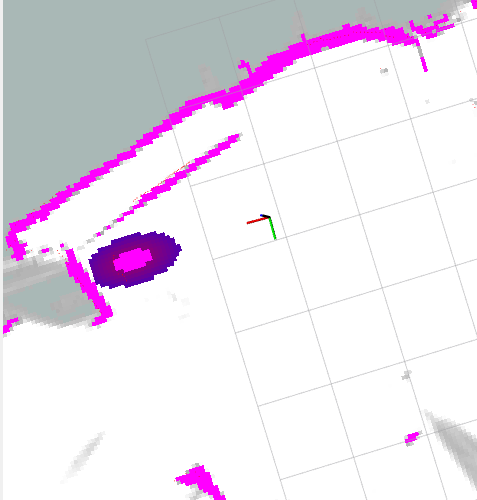

# proxemic_layer

This project contains the implementation of a proxemic layer for the costmaps of the ROS navigation stack.

## Included Nodes

### proxemic_layer
proxemic_layer is a layer for the costmap generation of the ROS navigation stack. A detailed description can be found in [this](https://link.springer.com/chapter/10.1007/978-3-030-39512-4_24) paper.

```latex
@inproceedings{
title	= {Modelling Proxemics for Human-Technology-Interaction in Decentralized Social-Robot-Systems},
author	= {Thomas Kirks, Jana Jost, Jan Finke, Sebastian Hoose},
year	= {2020},
booktitle = {Intelligent Human Systems Integration 2020},
publisher = {Springer}
pages = {153 - 158}
}
```

### people_publisher
people_publisher is a node which publishes test data for the proxemic_layer. It simply provides a dynamic_reconfigure parameterset which, after setting e.g. using rqt, is published to the /people topic, which again, is subscribed by the proxemic_layer.


## Usage
Simply copy the proxemic_layer into your ROS workspace. After doing so, you can start using the proxemic_layer as a layer of the costmap. See below for an example config file. The people_publishing is only provided for testing purpose, it is not necessary for the proxemic_layer to work.
- Usage details for the [proxemic_layer](src/proxemic_layer)
- Usage details for the [people_publisher](src/people_publisher)


## Example config and results of navigation stack layers

```yaml
plugins: 
    - {name: static_map,       type: "costmap_2d::StaticLayer"}
    - {name: obstacles,        type: "costmap_2d::VoxelLayer"}
    - {name: proxemic_layer,   type: "proxemic_layer::ProxemicLayer"}

static_map:
  lethal_cost_threshold: 55

obstacles:
  #obstacles from sensors definition

proxemic_layer:
  enabled: true
  max_time_passed: 10
  gaussian_renorming: 150
```

An example of the resulting proxemic:


